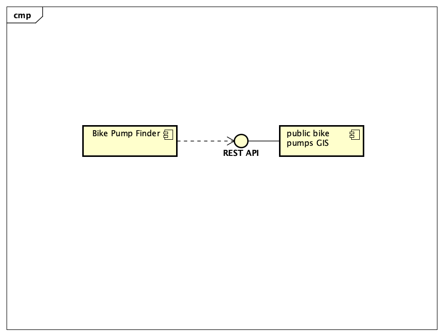

# Implementation

## Introduction
The implemented system is a mobile web-based application designed to facilitate the tracking of public toilet facilities. The dataset utilized by the system includes detailed information about the public toilets including their locations, accessibility features, and availability times. The dataset retreived from bristol open data is loaded streight into the web apps data table in a format that the user can read and understand it easily. One issues with the dataset is there may be occasional inaccuracies or incomplete information about the toilet locations or features. Overall, the system aims to be as accurate, reliable, and user freindly as possible using a detailed dataset and usefull features to have a seamless user experience.

## Project Structure
The layout of my folder can be seen below:

PottyPal is the main file which includes all of the html, css, and javascript required for the web app to run. Below this file is the docs file which is where all the documentation is included. Within the docs file is an images file which is a bank of all images used including diagrams and screenshots. The documentation is then split into planning, requirements, design, implementation, testing and deployment which all include different stages of documentation of development.

## Software Architecture 

### Frontend Architecture:
Frontend architecture is extremely important as it is essentially what the user will see and as they are who the app is made for it is important that it meets all their needs and expectations. This is why both frontend scripting for optimisation and user interface for the users own satisfaction are both very important in terms of frontend architecture.

#### Frontend scripting:
Frontend scripting breathes life into the app, allowing it to be more dynamic and interactive for the user. Here is how it enhances the frontend:

-Real-time Updates: Leveraging JavaScript frameworks, the app provides real-time updates to the UI, ensuring that users always have access to the latest information. 

-Component Reusability: The app uses a modular approach to development by taking advantage of reusable components. This modular architecture not only speeds up development but also promotes consistency and maintainability across the app which makes it much more easy as a developer.

-Seamless Interactivity: Frontend scripting enables seamless interactions within the app, such zooming for map navigation and other interactive options for intuitive user input. These interactive elements make the user experience more fluid and enjoyable.

-Efficient Resource Management: JavaScript frameworks optimize resource management on the client-side, minimizing network requests and reducing load times. Lazy loading of content and efficient DOM manipulation techniques ensure that the apps performance remains sufficient enough to do what they need to do even on lower end devices. By leveraging these frontend components and client-side scripting techniques, PottyPal delivers a simple and accessible experience, allowing users to use the app with confidence.

#### User Interface:

The User Interface (UI) of the PottyPal app plays a crucial role in user interactions and providing access to essential features and information:

-User accessability: The UI directly effects the users satisfaction and engagement. Having a well layed out and visually appealing interface enhances the overall user experience which makes it easier for users to find nearby public toilets, view details, and switch menues. All the important information and data must be clear and formated in well designed tables, and any interactive elements must be obvious to make it easier for users to find the necessary information.

-Selection: Interactive UI elements allow users to interact with the app in many ways. Features like menu navigation buttons, search bars and a interactive map enable users to search for specific toilets and explore nearby locations. Diversity will also be taken into account as the UI ensures accessibility for users with certain needs due to features such as large and obvious menu options and color contrast.

-Icons: Elements like maps and icons provide users with spatial context and help them visualize the locations of public toilets compared to their actual locations or surroundings. Maps allow users to explore nearby toilets visually and plan routes to desired destinations.

### Backend Architecture 

## Bristol Open Data API
TODO: Document each query to Bristol Open Data

TODO: Repeat as necessary
