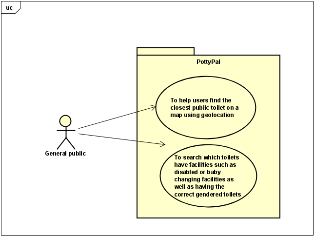

# Requirements

## User Needs

### User stories
As a parent, I need to find the closest public toilet with baby changing facilities to use changing rooms.

As a tourist, I want to find the closest public toilet to me as I do not know the area.

As part of the general public, I need to find a toilet that is suitable for my gender.

As someone with a disability, I need to find a public toilet with disabled facilities so I can access the toilet.

As someone up late, I need to find a toilet which is open at late hours so I do not waste time.

### Actors
Parent - Needs to find toilet with baby changing.

Tourist - Does not know the area at all so they need a map to find their way.

Public - Need to know where toilets are and if they are the correct gendered facilities.

Disabled people - Need disableded toilets.

Anyone who stays up late - Needs open toilet.

### Use Cases
| UC1 | Find toilets using geolocation | 
| -------------------------------------- | ------------------- |
| **Description** | User needs to find the closest public toilet to their currect location using a map and gps. |
| **Actors** | Everyone |
| **Assumptions** | They dont already know where the public toilets are, they are within a reasonable distance of the toilet
| **Steps** | The user requests to view the map, The app requests permission to access the users location, The nearest public toilet to the accessed user location is given to the user on the map  |
| **Variations** | If the user does not want to give location permissions then they can enter a location manually and the toilet can be found from there |
| **Non-functional** | TODO: OPTIONAL - List of non-functional requirements that the use case must meet. |
| **Issues** | If the user has no service their location cannot be found so the app will not work |

| UC2 | To find toilet that has specific facilities. | 
| -------------------------------------- | ------------------- |
| **Description** | Needs to find a toilet that has specific facilities. |
| **Actors** | Everyone |
| **Assumptions** | That the user needs a specific facility or doesnt already know which facilities are avaliable
| **Steps** | When the user requests to find a toilet they will be given a list of filters to apply such as specific gender, disabled toilets, baby changing rooms and more |
| **Variations** | If the user has no filteres to apply they can skip this step |
| **Non-functional** | TODO: OPTIONAL - List of non-functional requirements that the use case must meet. |
| **Issues** | Not all filteres can be covered so some users may be exluded |

## Software Requirements Specification
### Functional requirements
FR1 The system shall get the users geo-location from navigator.geolocation

FR2 The system shall get the nearest public toilets from the database

FR3 the system shall get the information for the specified toilet from the database

FR4 when appropriate, the system will filter out certain toilets even if they are closer but do not have the correct facilities

### Non-Functional Requirements
NFR1 The public toilets outside of the users selected range should not be displayed (Usability)

NFR2 The app should have a user freindly default browser when there is no geolocation avaliable (Reliability)

NFR3 The app should work on a smartphone (Portability)

NFR4 The data on the toilets should be as up to date and accurate as possible (Functional suitability)

NFR5 The app should provide a user interface with suitable sized text so most users can read it (Usability)

